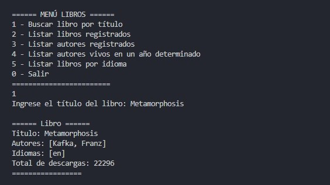
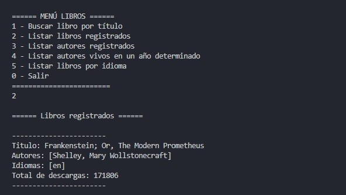
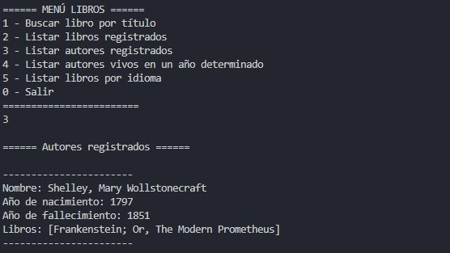
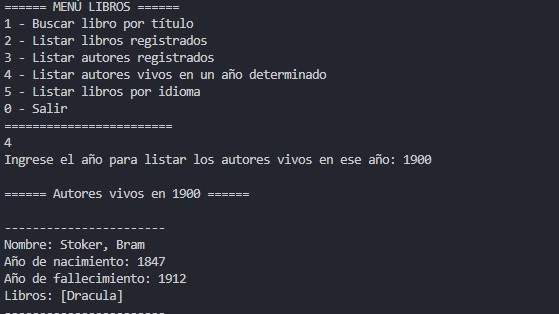
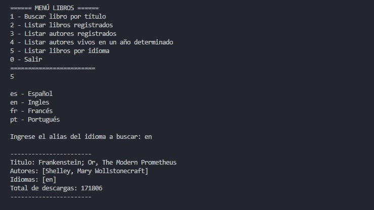

<h1 align="center"> Challenge Literalura - Oracle Next Education (ONE)</h1>

<p align="center">
  
</p>

Con este desafío propuesto en la Formación de Java y Spring Boot, creando una aplicación con conexión a una base de datos relacional. Se busca poner en práctica conceptos avanzados de Java y Spring, como el consumo de APIs externas, Java Persistence API, colecciones, streams, la persistencia de datos, entre otros.

---
## 💡 Sobre el Desafío 💡


---
## ✨ Características
- 📖 Buscar libro por título en la API Gutendex y registrarlo en la base de datos.
- 📚 Listar los libros registrados en la base de datos.
- 👨‍🎨 Listar los autores registrados en la base de datos.
- 📆 Listar los autores vivos apartir de un año determinado.
- 🖋 Listar los libros por idioma.

---
## 🖥 Tecnologías utilizadas
<div align="center">
  
  |    Tecnología   |                        Descripción                      |                              Icon                               |
  | :-------------: | :-----------------------------------------------------: | :-------------------------------------------------------------: |
  |      Java       |                 Lenguaje de programación                |       |
  |       Git       |             Sistema de control de versiones             |        |
  |      Maven      |           gestión y construcción de proyecto            |      |
  |   Spring Boot   |                        Framework                        |     |
  |    PostgreSQL   |         sistema almacenar y gestionar datos (DB)        |   |
  | Spring Data JPA |  persistencia de datos y mapeo objeto-relacional (ORM)  |                    |
  |  Gutendex API   | API para obtener la información de los libros y autores |                       |
   
</div>

---
## 📂 Estructura del Proyecto

```text
├── src/main/java/com/david/literalura
│   ├── model
│   │   ├── Autor.java
│   │   ├── DatosAutor.java
|   |   ├── DatosGutendex.java
|   |   ├── DatosLibro.java
|   |   └── Libro.java
│   │
│   ├── main 
|   |   ├── AutorRepository.java 
│   │   └── LibroRepository.java
│   │
│   └── service               
│       ├── ConsumoAPI.java
|       ├── ConvierteDatos.java
|       ├── IConvierteDatos.java
|       ├── LibroService.java
│       └── Menu.java
└── LiteraluraApplication.java
```

### Descripcion de Paquetes
- **com.david.literalura.model:** Contiene las clases que modelan los datos del dominio.
  - Incluye Entidades JPA (Libro, Autor) para el mapeo con la base de datos.
  - Incluye clases Record o DTOs (DatosLibro, DatosGutendex) utilizadas para mapear la respuesta JSON proveniente de la API externa.
- **com.david.literalura.repository:** Capa de persistencia de datos.
  - Contiene interfaces que extienden de JpaRepository (Spring Data JPA) para realizar operaciones CRUD y consultas personalizadas a la base de datos para Autores y Libros.
- **com.david.literalura.service:** Contiene la lógica de negocio y servicios de utilidad.
  - ConsumoAPI: Encargada de realizar las peticiones HTTP a la API externa (Gutendex).
  - ConvierteDatos: Implementación para transformar los datos crudos (JSON) en objetos Java.
  - Menu: Gestiona la interacción con el usuario a través de la consola.
  - LibroService: Orquesta el flujo de datos entre la API, la base de datos y el menú.
- **LiteraluraApplication.java:** Punto de entrada de la aplicación Spring Boot. Implementa CommandLineRunner para ejecutar el menú interactivo al iniciar el programa.

---

---
## 🖥 Screenshots
<table align="center">
  <tr>
    <td align="center"><br><sub><b>Buscar libro</b></sub></td>
    <td align="center"><br><sub><b>Libros registrados</b></sub></td>
  </tr>
  <tr>
    <td align="center"><br><sub><b>Autores registrados</b></sub></td>
    <td align="center"><br><sub><b>Autores vivos por año</b></sub></td>
  </tr>
   <tr>
    <td align="center"><br><sub><b>Libros por idioma</b></sub></td>
    <td align="center"><br><sub><b></b></sub></td>
  </tr>
</table>

---
## ✅ Prerrequisitos
ntes de comenzar, asegúrate de tener instalado lo siguiente en tu entorno local:
1. **Java JDK 17 o superior:** Necesario para ejecutar la aplicación Spring Boot.
    - *Verificar versión:* java -version
2. **Maven (Opcional):** Aunque el proyecto incluye el wrapper (mvnw), es recomendable tenerlo instalado.
    - *Verificar versión:* mvn -version
3. **Base de Datos (PostgreSQL):** Necesaria para persistir los datos de los libros y autores.
4. **IDE o Editor de Texto:** Se recomienda IntelliJ IDEA o Visual Studio Code (con el Extension Pack for Java).
5. **Git:** Para clonar el repositorio.

### ⚙️ Configuración de Variables de Entorno
El proyecto utiliza variables de entorno para proteger credenciales sensibles. Antes de ejecutar la aplicación:
1. Crea un archivo llamado .env en la raíz del proyecto (al mismo nivel que el pom.xml o src), define las siguientes variables dentro del archivo .env:
<pre>
  <code>
  # Configuración de APIs Externas
  APIGUTENDEX=https://gutendex.com/books/
  </code>
</pre>
3. Asegúrate de configurar las siguientes variables con tus credenciales de base de datos:  
<pre>
  <code>
  # Configuración de la Base de Datos
  DB_HOST=localhost
  DB_USER=tu_usuario_postgres
  DB_PASSWORD=tu_contraseña_postgres
  </code>
</pre>

**Nota Importante:** Según la configuración del proyecto, la aplicación intentará conectarse a una base de datos llamada literalura. Asegúrate de crearla en tu motor de PostgreSQL antes de iniciar: CREATE DATABASE literalura;

---
## 🚀 Ejecución del Proyecto
Una vez configuradas las variables de entorno y creada la base de datos, puedes ejecutar la aplicación de las siguientes maneras:

#### Opción 1: Desde la Terminal
Abre tu terminal en la carpeta raíz del proyecto y ejecuta el siguiente comando:
**En Windows:**
<pre>
  <code>
  ./mvnw spring-boot:run
  </code>
</pre>
**En Linux/Mac:**
<pre>
  <code>
  ./mvnw spring-boot:run
  </code>
</pre>

**Nota:** La primera vez que lo ejecutes, Maven descargará todas las dependencias necesarias, por lo que podría tardar unos minutos.

#### Opción 2: Desde tu IDE (IntelliJ IDEA / VS Code)
1. Abre el proyecto en tu IDE.
2. Localiza el archivo *src/main/java/com/david/literalura/LiteraluraApplication.java.*
3. Haz clic derecho sobre el archivo o busca el botón de "Run" (▶️) en la clase principal.

#### 📱 Interactuando con la Aplicación
Al finalizar el proceso de compilación, verás el logo de Spring en la consola. Inmediatamente después, aparecerá el menú interactivo de la aplicación directamente en la terminal:
<pre>
  <code>
  ====== MENÚ LIBROS ======
  1 - Buscar libro por título
  2 - Listar libros registrados
  3 - Listar autores registrados
  4 - Listar autores vivos en un año determinado
  5 - Listar libros por idioma
  0 - Salir
  ========================
  </code>
</pre>
Simplemente escribe el número de la opción deseada y presiona Enter para comenzar a consultar libros.

---
## 🌐 API de Referencia
Este proyecto consume datos de Gutendex, una API pública y gratuita que facilita el acceso al catálogo de Project Gutenberg.
- **Nombre:** Gutendex API
- **Documentación Oficial:** https://gutendex.com/
- **Endpoint Principal:** https://gutendex.com/books/
Uso en el Proyecto
La aplicación realiza peticiones **GET** al endpoint principal para buscar libros por título. La API devuelve un objeto JSON que contiene una lista de resultados, de los cuales se extraen datos clave como:
- Título del libro
- Nombre del autor y años de nacimiento/fallecimiento
- Idiomas disponibles
- Número de descargas

##### Ejemplo de Respuesta JSON
A continuación se muestra un fragmento simplificado de la estructura JSON que la aplicación recibe y procesa:
<pre>
  <code>
  {
    "count": 1,
    "results": [
      {
        "id": 84,
        "title": "Frankenstein; Or, The Modern Prometheus",
        "authors": [
          {
            "name": "Shelley, Mary Wollstonecraft",
            "birth_year": 1797,
            "death_year": 1851
          }
        ],
        "languages": [
          "en"
        ],
        "download_count": 84123
      }
    ]
  }
  </code>
</pre>

**Nota:** Esta API no requiere clave de autenticación (API Key), pero cuenta con límites de tasa de uso (rate limits) para evitar abusos.
